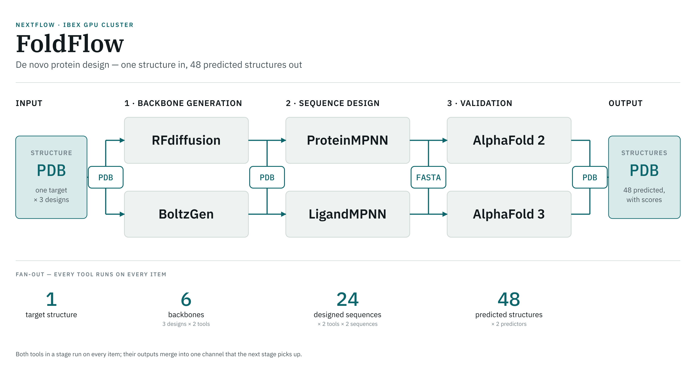

# FoldFlow — Protein Design Pipeline

A Nextflow DSL2 pipeline for de novo protein design: generate backbones, design sequences for
them, then fold those sequences back and score how well they match.



Each stage holds interchangeable tools that **all run on every item** — they are peers, not a
switch. Each stage's outputs are mixed into one channel that the next stage consumes.

| Stage | Tools (all run) | In | Out |
|-------|-----------------|----|-----|
| 1 · Backbone generation | RFdiffusion, BoltzGen | PDB | PDB + `.fixed_regions` |
| 2 · Sequence design | ProteinMPNN, LigandMPNN | PDB + `.fixed_regions` | FASTA |
| 3 · Validation | AlphaFold 2, AlphaFold 3 | FASTA | PDB + JSON scores |

With the defaults, one input structure produces 6 backbones, 24 designed sequences and
48 predictions — 66 tasks in total. `foldflow-pipeline.png` is a detailed version of the diagram
above, showing the channel passed at each hand-off.

## Quick Start

### Prerequisites

- Nextflow >= 24.04.0
- Singularity/Apptainer (or Docker)
- An NVIDIA GPU. BoltzGen needs compute capability >= 7.0; AlphaFold 3 needs >= 8.0.
- Model weights and sequence databases for the tools you intend to run (see
  [Pointing the pipeline at your system](#pointing-the-pipeline-at-your-system)).

### Run

```bash
nextflow run main.nf \
  --input_pdb 6px6.pdb \
  --output_prefix my_design \
  --outdir results \
  -profile singularity
```

`--input_pdb` is required; the run fails immediately without it.

### Check your setup first

A stub run exercises the whole workflow — every process, channel and publish path — without
GPUs, containers or model weights. Use it to confirm the wiring before committing real compute:

```bash
nextflow run main.nf -profile test -stub-run --input_pdb 6px6.pdb
```

## How configuration works

There are exactly two places to configure this pipeline, and nothing needs editing anywhere else:

1. **Nextflow config** — pipeline-level parameters and anything about *how* jobs run (executor,
   resources, containers, publish paths). Set these on the command line, in a `-params-file`, or
   in your own config passed with `-c`. You never have to edit a tracked file.
2. **`configs/*.yaml`** — one file per module, holding that tool's own settings and the paths on
   *your* system where its weights and databases live.

Inside the YAML files, **keys beginning with `_` are read by the Nextflow module itself** — host
paths, container images, data directories. The module bind-mounts these into the container
automatically. Every other key is passed through to the underlying tool.

To use a different YAML without editing the shipped one, point the module at yours:

```bash
nextflow run main.nf --input_pdb in.pdb \
  --alphafold3_config_path /my/configs \
  --alphafold3_config_name AlphaFold3.yaml
```

Every module takes the same pair: `<module>_config_path` and `<module>_config_name`.

## Pipeline parameters

| Parameter | Default | Description |
|-----------|---------|-------------|
| `input_pdb` | *(none — required)* | Target structure to design against |
| `output_prefix` | `design` | Names the results subfolder and is embedded in output filenames |
| `outdir` | `./results` | Output directory |
| `publish_dir_mode` | `copy` | How results are published (`copy`, `symlink`, `link`, …) |
| `rfdiff_num_designs` | `3` | Design indices. Each backbone tool runs once per index |
| `mpnn_num_sequences` | `2` | Sequences per backbone from ProteinMPNN |
| `ligandmpnn_num_sequences` | `2` | Sequences per backbone from LigandMPNN |
| `rfdiff_config_path` / `_name` | `configs/` · `RFdiffusion.yaml` | Which YAML configures RFdiffusion |
| `boltzgen_config_path` / `_name` | `configs/` · `Boltzgen.yaml` | …BoltzGen |
| `mpnn_config_path` / `_name` | `configs/` · `MPNN.yaml` | …ProteinMPNN |
| `ligandmpnn_config_path` / `_name` | `configs/` · `LigandMPNN.yaml` | …LigandMPNN |
| `alphafold_config_path` / `_name` | `configs/` · `AlphaFold.yaml` | …AlphaFold 2 |
| `alphafold3_config_path` / `_name` | `configs/` · `AlphaFold3.yaml` | …AlphaFold 3 |

> `--num_designs` appears in `main.nf` as a fallback but can never take effect, because
> `rfdiff_num_designs` always carries a default. Use `--rfdiff_num_designs`.

## Pointing the pipeline at your system

These are the values a new installation has to supply. All of them live in `configs/*.yaml`, and
each is bind-mounted into the container for you. The paths shipped in this repository point at one
particular cluster — replace them with your own.

| File | Key | What it must point at |
|------|-----|----------------------|
| `RFdiffusion.yaml` | `_schedule_dir` | RFdiffusion noise schedules |
| | `_model_dir` | RFdiffusion checkpoints |
| | `_editables_dir` | Base used for the two defaults above; defaults to the project directory |
| `Boltzgen.yaml` | `_model_dir` | BoltzGen weights; mounted at `/models` and used as the Hugging Face cache |
| `MPNN.yaml` | `path_to_model_weights` | Leave empty to use the weights inside the container |
| | `model_name` | Which ProteinMPNN checkpoint, e.g. `v_48_020` |
| `LigandMPNN.yaml` | `checkpoint_ligand_mpnn` | Checkpoint path; the default is inside the container |
| | `_model_weights_path` | Only needed if weights live outside the container |
| `AlphaFold.yaml` | `_data_dir` | AlphaFold 2 genetic databases |
| | `_cuda_lib_dir` | Host CUDA libraries, if the container needs them |
| | `_jax_platform` | `cuda`, or `cpu` to force CPU |
| `AlphaFold3.yaml` | `_container` | The AlphaFold 3 SIF you built (see below) |
| | `_db_dir` | AlphaFold 3 genetic databases |
| | `_model_path` | AlphaFold 3 weights file |

Tool behaviour (template dates, presets, sampling temperature, diffusion samples, contigs, entity
specs) is set by the non-`_` keys in the same files.

### Containers

Five of the six modules name a public image, which Nextflow pulls on first use. To use an image you
have already pulled — or a local SIF on a machine with no outbound network — override it per
process in your own config. Nothing in the modules needs changing:

```groovy
// my-site.config
process {
    withName: 'RFDIFFUSION' { container = '/opt/sif/rfdiffusion.sif' }
    withName: 'PROTEINMPNN' { container = '/opt/sif/proteinmpnn.sif' }
}
singularity {
    enabled   = true
    autoMounts = true
    runOptions = '--nv'          // required for GPU access
    cacheDir  = '/scratch/$USER/singularity'
}
```

```bash
nextflow run main.nf --input_pdb in.pdb -profile singularity -c my-site.config
```

AlphaFold 3 is the exception: it has no public image, so its container comes from `_container` in
`configs/AlphaFold3.yaml`.

### Executor and resources

`conf/base.config` sets resources by label (`process_gpu`, `process_high_memory`, …) and
`conf/modules.config` sets them per process along with publish paths. Override either from your own
`-c` config rather than editing them:

```groovy
process {
    executor = 'slurm'
    queue    = 'gpu'
    withLabel: 'process_gpu'  { cpus = 16; memory = '128.GB'; time = '12.h' }
    withName:  '.*:ALPHAFOLD3' { clusterOptions = '--gres=gpu:a100:1' }
}
```

Built-in profiles: `test`, `singularity`, `docker`, `podman`, `shifter`, `charliecloud`, `conda`,
`mamba`, `arm`, `debug`, `slurm`. `conf/slurm.config` is a generic SLURM starting point. Profiles
named after a specific cluster are examples, not something you need.

> A `withName` selector in an executor config that is spelled **exactly** the same as one in
> `conf/modules.config` *replaces* that block instead of merging with it, silently dropping its
> publish paths and retries. Match on the qualified name — `'.*:ALPHAFOLD3'` — to merge instead.

### AlphaFold 3 container

DeepMind publishes no AlphaFold 3 image, and their Dockerfile needs root, so the image is built
locally. On a host with Singularity and internet access:

```bash
bash modules/local/alphafold3/build_container.sh [OUTPUT_SIF]
```

The script reproduces DeepMind's Dockerfile without root: it pulls a base image that already has
the required apt packages as a writable sandbox, builds HMMER and AlphaFold 3 inside it, then packs
the result into a SIF. Expect roughly 30 minutes and ~15 GB of scratch space. Then set `_container`
in `configs/AlphaFold3.yaml`.

Model parameters must be requested from Google and are subject to their terms of use; they are not
redistributed here. If your weights directory holds both `af3.bin` and `af3.bin.zst`, only the file
named in `_model_path` is staged, since AlphaFold 3 otherwise prefers the compressed one.

## Output

```
results/
├── <output_prefix>/
│   ├── rfdiffusion/      # *_rfdiffusion.pdb, *.fixed_regions
│   ├── proteinmpnn/      # {lineage}_mpnn_{n}_proteinmpnn.fa
│   ├── ligandmpnn/       # {lineage}_mpnn_{n}_ligandmpnn.fa
│   ├── alphafold/        # ranked_*.pdb, timings JSON
│   └── alphafold3/       # model_*.pdb/.cif, confidences JSON, ranking CSV
├── boltzgen/             # see Known issues — should sit under <output_prefix>/
└── pipeline_info/        # execution report, timeline, trace, DAG
```

### Reading a filename

Every tool appends its own tag, so a final structure records the whole path that produced it:

```
model_boltzgen_3_mpnn_1_ligandmpnn_alphafold_1_alphafold3.pdb
      └──┬─────┘ └──┬─┘ └────┬────┘           └────┬─────┘
    backbone tool   │   sequence tool        predictor
    + design index  └── which sampled sequence
```

This lineage travels in the `meta` map through the whole workflow, so any output traces back
without opening a log.

## Repository layout

```
├── main.nf                          # entry point: reads input, fans out design indices
├── nextflow.config                  # pipeline params and profiles
├── workflows/foldflow.nf            # stage wiring
├── modules/local/
│   ├── rfdiffusion/                 # each: main.nf, environment.yml, main.nf.test
│   ├── boltzgen/
│   ├── proteinmpnn/
│   ├── ligandmpnn/
│   ├── alphafold/
│   └── alphafold3/                  # + build_container.sh
├── conf/
│   ├── base.config                  # resources by label
│   ├── modules.config               # per-process publish paths and resources
│   ├── slurm.config                 # generic SLURM executor
│   └── test.config                  # test profile
├── configs/                         # per-module YAML — your paths go here
│   ├── RFdiffusion.yaml
│   ├── Boltzgen.yaml
│   ├── MPNN.yaml
│   ├── LigandMPNN.yaml
│   ├── AlphaFold.yaml
│   └── AlphaFold3.yaml
└── bin/
    ├── reformat_fixed_residues.py   # RFdiffusion TRB -> .fixed_regions
    ├── split_mpnn_fastas.py         # one sequence per FASTA
    ├── fasta_to_af3_json.py         # FASTA -> AlphaFold 3 input JSON
    └── yaml_to_args.py              # YAML -> CLI flags
```

## Adding a tool to a stage

The pattern is identical at every stage, and is how AlphaFold 3 joined the validation layer
alongside AlphaFold 2:

1. Add `include { NEWTOOL } from '../modules/local/newtool/main'` in `workflows/foldflow.nf`.
2. Call `NEWTOOL(<the stage's shared input channel>)` beside the existing tools.
3. Mix its outputs into that stage's combined channel so downstream stages see one stream.
4. Add a `withName: 'NEWTOOL'` block in `conf/modules.config` for its publish path and resources.

To drop a tool from a run without deleting it, set `ext.when = false` on its `withName` block.

## Known issues

- **AlphaFold 2 outputs overwrite each other.** Its filenames carry the backbone lineage but not
  the sequence-design tool, so a ProteinMPNN and a LigandMPNN sequence from the same backbone
  publish to the same name. AlphaFold 3's names include the tool, so they stay distinct.
- **BoltzGen publishes to `results/boltzgen/`** instead of `results/<output_prefix>/boltzgen/`,
  because of the `withName` collision described under *Executor and resources*. Matching on
  `'.*:BOLTZGEN'` in the executor config fixes it.
- **The run summary always says failed.** The `onComplete` block in `main.nf` prints
  `Execution status: failed` even on a clean run. Check the exit status instead.
- **`max_cpus`, `max_memory` and `max_time` are declared but not enforced.** No `check_max()`
  helper reads them, so passing `--max_memory` has no effect. Set resources per label or per
  process in your own `-c` config instead, as shown under *Executor and resources*.
- **`nextflow_schema.json` is absent**, so `Could not read parameters settings from JSON` is printed
  on every run and parameters are not validated. Harmless; the table above is the reference.

## Troubleshooting

On failure, read `.nextflow.log`, then the failing task's `.command.err`, `.command.log` and
`.command.sh` in its work directory — the path is printed in the error message.

**GPU not detected** — Singularity needs `runOptions = '--nv'`; Docker needs `--gpus all`.

**Container path errors** — the modules bind-mount the host paths named by the `_`-prefixed YAML
keys. Check those exist and are readable from the compute node, not just the submit node.

**AlphaFold 3 fails immediately** — the module checks its container, database directory and weights
before running, and reports which one is missing.

**Out of memory** — raise the `process_gpu` or `process_high_memory` label in your own `-c` config;
AlphaFold is the usual culprit on long sequences.

## Testing

```bash
nextflow run main.nf -profile test -stub-run --input_pdb 6px6.pdb   # whole workflow, no compute
nf-test test modules/local/<tool>/main.nf.test                      # one module
```

## Citation

- RFdiffusion — Watson et al., *Nature* 2023
- BoltzGen — https://github.com/HannesStark/boltzgen
- ProteinMPNN — Dauparas et al., *Science* 2022
- LigandMPNN — Dauparas et al.; https://github.com/dauparas/LigandMPNN
- AlphaFold 2 — Jumper et al., *Nature* 2021
- AlphaFold 3 — Abramson et al., *Nature* 2024; see also the AlphaFold 3 terms of use

## License

MIT License
